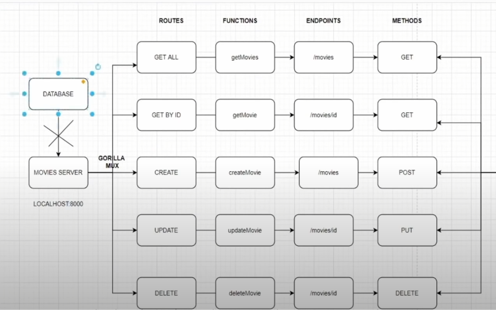
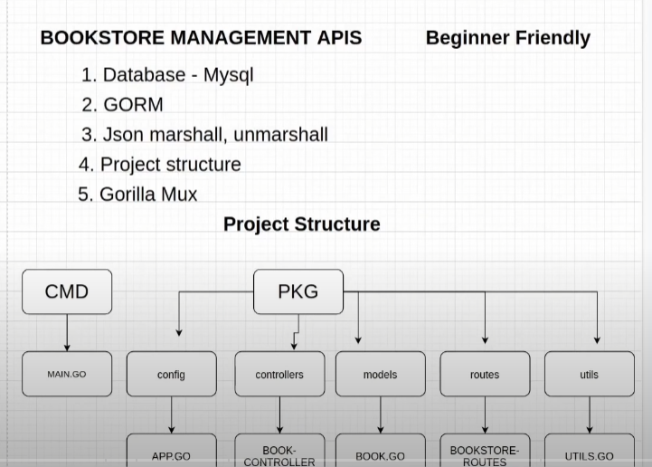
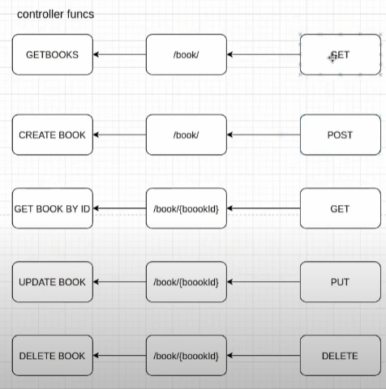

# Golang-projects
A repository that hosts my Golang Projects

## List of the projects to be created:
1. Simple Web Server
2. CRUD API

3. MYSQL Book Management System

4. SlackBot To Calculate Age
5. Slackbot for File Uploading
6. Email Verifier Tool
7. AWS Lambda
8. CRM Fiber
9. HRMS Fiber
10. Complete serverless stack
11. A.I Bot with wolfram and wit.ai
